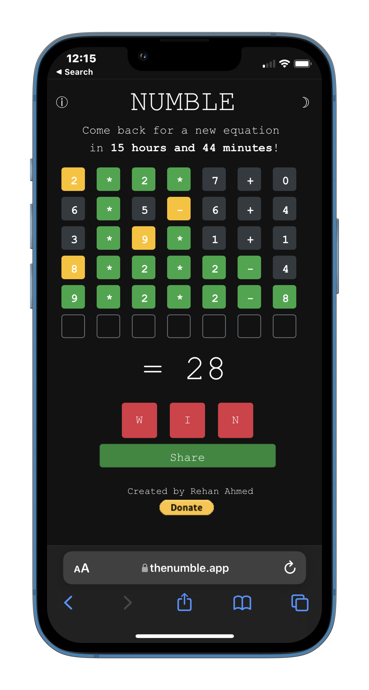
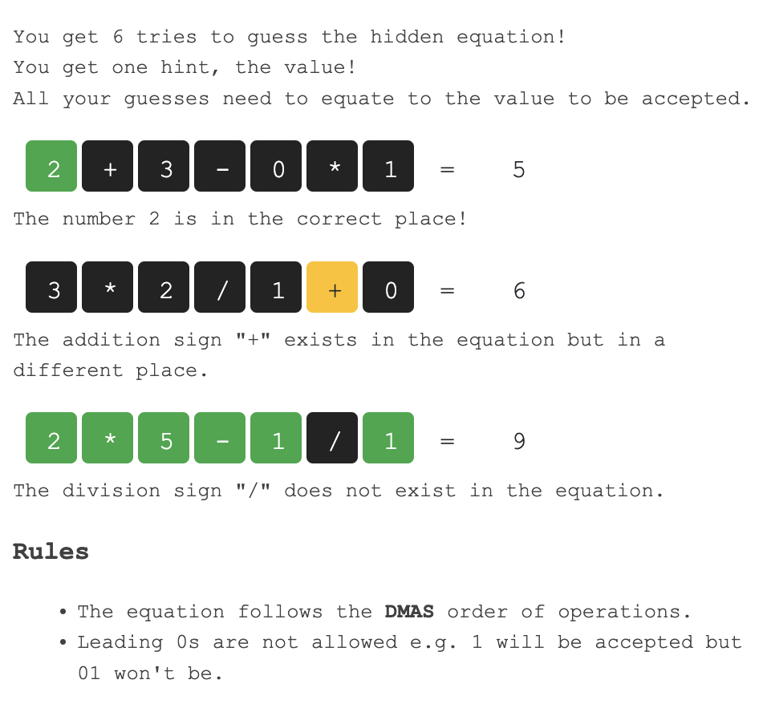

#  NUMBLE
<a href = "https://thenumble.app"></a>
<a href="https://www.producthunt.com/posts/numble?utm_source=badge-featured&utm_medium=badge&utm_souce=badge-numble" target="_blank"></a><br>

## What is Numble?

Numble is a game like Wordle, but for math nerds. You guess an equation in 6 guesses or less, with a new equation every day!

- [Featured on the Guardian](https://www.theguardian.com/games/2022/feb/06/worried-about-losing-wordle-here-are-some-alternatives-just-in-case) 🔥
- 1K+ users on Day 1 of launch
- Crossed 100k pageviews in one month, 3K users per day
- Came across a 🐞? Drop me a [tweet/dm](https://twitter.com/ReallyRehan)
- **330,000** people have played Numble to date
- Over **1 Million** games have been played

## 🎉 Major Update: Client-Side Migration (2024)

**Numble has been migrated from a server-side app to a fully client-side application!**

### Why the Change?
To **save on server costs** - Numble previously cost **$96/year** to run on Heroku. The new client-only version can be hosted for **free** on platforms like Cloudflare Pages, reducing costs by 100% while maintaining all core game functionality.

### What Changed?

**Architecture:**
- **Before**: Python Flask backend + Redis + Heroku hosting
- **After**: Pure JavaScript client-side app + static hosting (Cloudflare Pages)

**Code Structure:**
- `client_app/` - New client-only version (deployed to production)
- `server_side_app/` - Original server-side code (kept for reference)

**Key Conversions:**
- Python backend logic → JavaScript
- Flask sessions → localStorage
- Redis global stats → localStorage (personal stats only)
- Server-side validation → Client-side validation

### What Still Works? ✅
- ✅ Daily puzzle generation (same algorithm, same puzzles)
- ✅ All game mechanics (guessing, validation, feedback)
- ✅ Personal statistics tracking
- ✅ Dark mode
- ✅ Custom seeds (mynumble)
- ✅ Game state persistence (localStorage)
- ✅ Google Analytics tracking
- ✅ Ezoic ads integration

### What's Different? ⚠️

**Limitations:**
- ❌ **Global statistics** - No longer aggregated across all users (requires server)
- ❌ **Cross-device sync** - Stats are device-specific (localStorage limitation)
- ❌ **Server-side security** - All validation is client-side (users can inspect/modify code)
- ❌ **Server-side analytics** - Only client-side analytics available

**⚠️ Important Migration Note:**
Unfortunately, **all previous statistics were lost** during the migration. This is because:
- Old stats were stored in **server-side Flask sessions** (on Heroku)
- New stats are stored in **browser localStorage** (client-side)
- There's no way to migrate data from server sessions to client localStorage

All users will start fresh with their statistics. The game functionality remains identical, but your previous win/loss history and guess distributions are no longer available.

**Note**: These limitations are expected for a client-only app and don't affect the core game experience. Personal statistics still work perfectly going forward!

For detailed limitations, see [`client_app/LIMITATIONS.md`](client_app/LIMITATIONS.md)

### Deployment

The client app is designed to be deployed to **Cloudflare Pages** (free) or any static hosting service:
- No server required
- No database needed
- Zero hosting costs
- Fast global CDN

See [`client_app/README.md`](client_app/README.md) for deployment instructions.

---

## Keep Numble Alive! 🚨

**Cost Update**: With the client-side migration, hosting costs are now **$0/year** (down from $96/year)! 🎉

However, the domain still costs **$12/year**. If you want to help keep Numble alive, you can <a href="https://www.buymeacoffee.com/rehanahmed"></a> or send me a [donation on Paypal](https://www.paypal.com/donate?token=lNMWMc2-OqZfTym_gN7fGZGFmKN_ucnCHVSa-qwHhOvmZyDWcTxCeATUIuTfAB2a8Ki9WkPsr5kM5PBG)

## How to Play?




# Project Structure

```
public_app/
├── client_app/          # 🆕 Client-only version (CURRENT - deployed to production)
│   ├── index.html       # Main game page
│   ├── js/              # JavaScript game logic
│   ├── css/             # Stylesheets
│   └── README.md        # Client app documentation
│
├── server_side_app/     # 📦 Original server-side version (kept for reference)
│   ├── run.py           # Flask backend
│   ├── utils.py         # Equation generator
│   ├── templates/       # HTML templates
│   └── static/          # Static assets
│
├── README.md            # This file
└── ...                  # Shared assets (logo, mockup, etc.)
```

**Current Production Version**: `client_app/` (client-only, deployed to Cloudflare Pages)  
**Legacy Version**: `server_side_app/` (original Heroku deployment, kept for reference)

# How to Contribute?

Make Numble better, however you want! The current active codebase is in `client_app/`:
- Improve the JavaScript game logic
- Enhance the UI/UX
- Add new features (keeping in mind client-only limitations)
- Optimize performance
- Fix bugs

The original server-side code in `server_side_app/` is kept for reference but is no longer actively maintained.

I am a Data Scientist, and as for all my web development skills -> I just want to make things work. So feel free to make big changes. I don't actively work on this project but would be happy to help in reviewing/approving your pull requests.

Oh and if you need some ideas on where to start, here is a laundry list of things that I wanted to do but never got around to,

## To-Do

### Completed ✅
- [x] Fix Zero Equation Issue - no more 0 with x and /
- [x] change the colors of the available digits so more contrast between unused and unavailable.  Black and grey are close
- [x] Add #thenumble to text
- [x] Add Dark Mode
- [x] Add stats
- [x] refresh session every day
- [x] Improve Colors
- [x] Python - JavaScript - Performance - half
- [x] Fix animation
- [x] Fix divide
- [x] Fix Cache - Persistent Storage
- [x] Remove debugging info - console.log, print
- [x] dynamic equation generation
- [x] Fix the stupid = 
- [x] Fix double enter error - add disable enter boolean
- [x] Add time left
- [x] Help page
- [x] Lost - share word
- [x] Lost - remove 6/6
- [x] Word changed - update user / Cache equation
- [x] Privacy Policy
- [x] User stats
- [x] Custom seeds (mynumble)
- [x] Separate JavaScript
- [x] **Migrate to client-side architecture** 🎉

### Future Enhancements
- [ ] = animation?
- [ ] Add global Stats (requires server - see limitations)
- [ ] Add numblers today - count (requires server)
- [ ] add IP? (not applicable for client-only)
- [ ] add error messages (like no leading zeroes) - dont cheat
- [ ] easy, medium, hard modes
- [ ] Hints
- [ ] Fix 00 - leading zeros before 0 (except 100 200 etc)
- [ ] Add different colors for associativity
- [ ] Timed scores - how long did you take
- [ ] Analyze and fix issues - [RankWatch](https://www.rankwatch.com/en/tools/web-analyzer/8cf045b5de73d60bb562086131b4abf2.html)
- [ ] Add sitemap
- [ ] Add robots.txt
- [ ] Add about
- [ ] Add preview image
- [ ] Add alts for images (including Paypal donate button)
- [ ] Add timeout for stats card